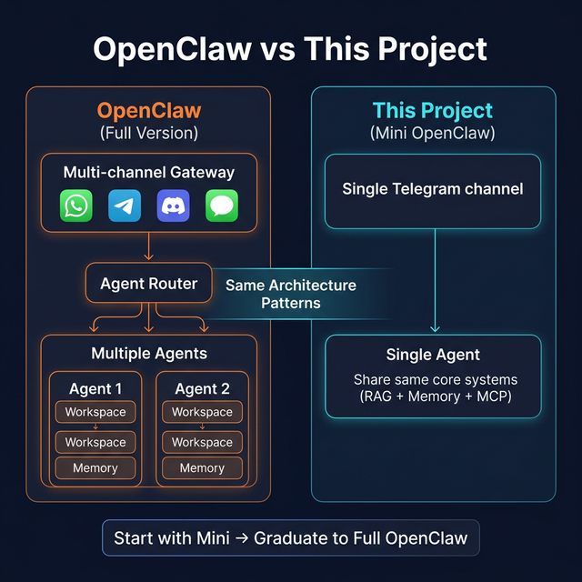

# 🤖 Telegram AI Assistant — Mini OpenClaw

> **A simplified, educational implementation of the [OpenClaw](https://github.com/openclaw/openclaw) architecture — a production-grade Telegram bot that can search your message history, remember your preferences across conversations, and interact with GitHub & Notion through natural language.**

[](https://nodejs.org/)
[](https://www.typescriptlang.org/)
[](https://telegraf.js.org/)
[](LICENSE)

---

## 📖 What Is This Project?

This is a **mini version of [OpenClaw](https://openclaw.ai)** — the open-source personal AI assistant framework. While the full OpenClaw supports multiple channels (WhatsApp, Telegram, Discord, iMessage), multi-agent routing, and a Gateway control plane, **this project focuses on the core architecture patterns** to help you understand how it all works.

> **🦞 What is OpenClaw?**
> [OpenClaw](https://docs.openclaw.ai) is a self-hosted, open-source AI assistant that runs on your own hardware. It connects messaging platforms to AI models with tool use, sessions, memory, and multi-agent routing. This project implements the same three core AI systems that power OpenClaw, simplified for learning and practical use.

### The Three Core Systems (Same as OpenClaw)

| System | OpenClaw | This Project (Mini Version) |
|--------|----------|---------------------------|
| **🔍 RAG** | Hybrid BM25 + vector search over file-first memory | Vector search over message history using OpenAI embeddings |
| **🧠 Memory** | Ephemeral (daily logs) + Durable (MEMORY.md) | Short-term (SQLite session) + Long-term (mem0.ai cloud) |
| **🔌 MCP** | Full MCP Gateway with multi-agent routing | MCP client connecting to GitHub & Notion servers |
| **📱 Channel** | WhatsApp, Telegram, Discord, iMessage, Web | Telegram only (easily extensible) |

### How They Compare



> **💡 Why study this project?** If you want to understand how OpenClaw's RAG, Memory, and MCP systems work internally — without the complexity of multi-channel routing and agent orchestration — this codebase is the perfect starting point.

---

## 📋 Table of Contents

- [What Is This Project?](#-what-is-this-project)
- [Architecture Overview](#-architecture-overview)
- [How Every Message Gets Processed](#-how-every-message-gets-processed)
- [Installation (Step by Step)](#-installation-step-by-step)
- [Configuration Reference](#-configuration-reference)
- [Usage Examples](#-usage-examples)
- [Available Commands & Tools](#-available-commands--tools)
- [Project Structure Explained](#-project-structure-explained)
- [Understanding the Code](#-understanding-the-code)
- [OpenClaw Architecture Comparison](#-openclaw-architecture-comparison)
- [Troubleshooting](#-troubleshooting)
- [Detailed Documentation](#-detailed-documentation)
- [Contributing](#-contributing)

---

## 🏗 Architecture Overview

Here's how all the pieces fit together. This mirrors OpenClaw's design: a **Channel Layer** receives messages, an **Agent** orchestrates the AI, and **RAG + Memory + MCP** provide intelligence.


### Where Each System Lives

| System | Files | OpenClaw Equivalent |
|--------|-------|---------------------|
| **Telegram Handler** | `src/channels/telegram.ts` | Gateway Channel Adapter |
| **AI Agent** | `src/agents/agent.ts` | Agent Workspace |
| **RAG** | `src/rag/` (4 files) | Memory + Semantic Search |
| **Memory** | `src/memory-ai/mem0-client.ts` | Durable Memory (MEMORY.md) |
| **Session DB** | `src/memory/database.ts` | SQLite Session Store |
| **MCP** | `src/mcp/` (4 files) | MCP Tool Integration |
| **Telegram Tools** | `src/tools/telegram-actions.ts` | Channel-specific Tools |
| **Scheduler** | `src/tools/scheduler.ts` | Task Scheduler |
| **Config** | `src/config/index.ts` | openclaw.json config |

---

## 🔄 How Every Message Gets Processed

Here's exactly what happens when you send a message to the bot, step by step:


### Step 1: Message Arrives (`telegram.ts`)

```
Telegram Server → Telegraf SDK → Your bot receives the message

The handler checks:
  ✓ Is this a private chat (DM)?         → Always process
  ✓ Is this a group and bot @mentioned?   → Process only if mentioned
  ✓ Is the user allowed?                  → Check TELEGRAM_ALLOWED_USERS
  ✓ Send typing indicator (...)           → User sees "bot is typing"
```

### Step 2: Memory Retrieval (`mem0-client.ts`)

```
Query mem0.ai: "What do I know about user 123456?"

Returns memories like:
  • "User prefers Python over JavaScript"
  • "User works on a web application project"
  • "User is a backend engineer"
```

### Step 3: RAG Pre-Check (`retriever.ts`)

```
Analyze the message: Does it ask about past discussions?

"What did we decide about the API?" → YES, use RAG
"Write me a hello world" → NO, skip RAG

If YES, search the vector store:
  • Convert question to a 1536-dimension vector
  • Find the 10 most similar message vectors
  • Return those messages as context
```

### Step 4: Build LLM Context (`agent.ts`)

```
The agent assembles everything into one prompt:

System Prompt:      "You are a helpful AI assistant on Telegram..."
+ Memory Context:   "User prefers Python, works on web app..."
+ RAG Context:      "Relevant past messages about the API..."
+ Session History:  "Last 10 messages in this conversation"
+ Available Tools:  "12 Telegram tools + 26 GitHub tools + 21 Notion tools"
```

### Step 5: LLM Decides & Acts (`agent.ts`)

```
Send everything to GPT-4o (or Claude)

LLM thinks: "User wants a GitHub issue created. I should call
            github_create_issue with title 'API timeout bug'"

Agent executes the tool → Gets result → Loops back to LLM
LLM formats the final response → Sends to user
```

### Step 6: Save Memories (Background)

```
After responding, agent analyzes the full conversation:

"Did the user reveal any new facts?"
  → YES: "User reported an API bug" → Store in mem0
  → NO: Skip memory storage
```

---

## 📦 Installation (Step by Step)

### What You Need Before Starting

| Requirement | Why | How to Get It |
|-------------|-----|---------------|
| **Node.js 18+** | Runtime for the bot | [nodejs.org](https://nodejs.org/) |
| **npm** | Package manager (comes with Node.js) | Installed with Node.js |
| **Telegram Bot Token** | To connect to Telegram | Created via @BotFather (see below) |
| **OpenAI API Key** | Powers the AI brain + embeddings | [platform.openai.com](https://platform.openai.com) |
| **GitHub Token** *(optional)* | For GitHub integration | [github.com/settings/tokens](https://github.com/settings/tokens) |
| **Notion Token** *(optional)* | For Notion integration | [notion.so/my-integrations](https://www.notion.so/my-integrations) |
| **mem0 API Key** *(optional)* | For long-term memory | [app.mem0.ai](https://app.mem0.ai) |

### Step 1: Clone & Install Dependencies

```bash
# Clone the repository
git clone https://github.com/Maimuzamilhu/openclaw-telegram-starter.git
cd telegram-ai-assistant

# Install all dependencies (this downloads ~230 packages)
npm install
```

**What happens:** npm reads `package.json` and installs everything the bot needs — the Telegram SDK (Telegraf), OpenAI client, SQLite database, vector store, and more.

### Step 2: Create Your Telegram Bot

1. Open Telegram and search for **@BotFather**
2. Send `/newbot`
3. Follow the prompts:
   - Give your bot a **name** (e.g., "My AI Assistant")
   - Give your bot a **username** (e.g., `my_ai_assistant_bot`)
4. BotFather will reply with your **token** — it looks like:
   ```
   123456789:ABCdefGHIjklMNOpqrsTUVwxyz
   ```
5. **Save this token** — you'll need it in Step 4

> 💡 **Tip:** You can also set a profile picture and description for your bot by sending commands to BotFather:
> - `/setuserpic` — Set bot avatar
> - `/setdescription` — Set bot description
> - `/setcommands` — Register the command menu

### Step 3: Get Your API Keys

**OpenAI API Key** (Required):
1. Go to [platform.openai.com/api-keys](https://platform.openai.com/api-keys)
2. Click "Create new secret key"
3. Copy the key (starts with `sk-`)

**GitHub Token** (Optional — for GitHub features):
1. Go to [github.com/settings/tokens](https://github.com/settings/tokens)
2. Click "Generate new token (classic)"
3. Select scopes: `repo`, `issues`
4. Copy the token (starts with `ghp_`)

**Notion Token** (Optional — for Notion features):
1. Go to [notion.so/my-integrations](https://www.notion.so/my-integrations)
2. Click "New integration"
3. Name it "Telegram AI Assistant"
4. Copy the token (starts with `secret_`)
5. **Important:** Share your Notion pages with the integration:
   - Open any page → Click "..." → "Add connections" → Select your integration

**mem0 API Key** (Optional — for long-term memory):
1. Go to [app.mem0.ai](https://app.mem0.ai)
2. Create an account
3. Copy your API key (starts with `m0-`)

### Step 4: Configure Environment Variables

```bash
# Copy the example environment file
cp .env.example .env
```

Now edit `.env` with your keys:

```env
# ═══════════════════════════════════════════════
# REQUIRED — Bot won't start without these
# ═══════════════════════════════════════════════

# Your Telegram bot token from @BotFather
TELEGRAM_BOT_TOKEN=your_token_here

# Your OpenAI API key (for AI brain + text embeddings)
OPENAI_API_KEY=sk-your-key-here

# ═══════════════════════════════════════════════
# OPTIONAL — Extra features
# ═══════════════════════════════════════════════

# AI model to use (default: gpt-4o)
DEFAULT_MODEL=gpt-4o

# Long-term memory (remembers user preferences across sessions)
MEM0_API_KEY=m0-your-key-here
MEMORY_ENABLED=true

# GitHub integration (create issues, search repos, etc.)
GITHUB_PERSONAL_ACCESS_TOKEN=ghp_your-token-here

# Notion integration (search pages, read docs, etc.)
NOTION_API_TOKEN=secret_your-token-here

# Who can use the bot? (* = everyone, or comma-separated Telegram user IDs)
TELEGRAM_ALLOWED_USERS=*

# Log verbosity (debug | info | warn | error)
LOG_LEVEL=info
```

### Step 5: Start the Bot

```bash
# Development mode (auto-restarts when you change code)
npm run dev

# OR Production mode
npm run build
npm start
```

### What You Should See

```
[info] ✅ Database initialized
[info] ✅ Vector store initialized
[info] ✅ Memory system initialized
[info] ✅ MCP initialized: github, notion
[info] ✅ Task scheduler started
[info] ✅ Telegram bot started

🚀 Telegram AI Assistant is running!

Features enabled:
  • RAG (Semantic Search): ✅
  • Long-Term Memory: ✅
  • MCP (GitHub/Notion): ✅ github, notion
  • Task Scheduler: ✅

Press Ctrl+C to stop
```

### Step 6: Test It!

Open Telegram → Find your bot → Send a message:

```
You:  Hello!
Bot:  Hi! I'm your AI assistant. I can help you with:
      • Searching past conversations
      • Managing GitHub repos and issues
      • Searching Notion pages
      • Scheduling reminders
      • Remembering your preferences
      
      Try /help to see all commands!
```

---

## ⚙️ Configuration Reference

### All Environment Variables

| Variable | Required | Default | Description |
|----------|:--------:|---------|-------------|
| **Telegram** | | | |
| `TELEGRAM_BOT_TOKEN` | ✅ | — | Bot token from @BotFather |
| `TELEGRAM_ALLOWED_USERS` | | `*` | Comma-separated user IDs, or `*` for all |
| **AI** | | | |
| `OPENAI_API_KEY` | ✅ | — | OpenAI API key for LLM + embeddings |
| `ANTHROPIC_API_KEY` | | — | Anthropic API key (alternative to OpenAI) |
| `DEFAULT_MODEL` | | `gpt-4o` | Which AI model to use |
| **Memory** | | | |
| `MEM0_API_KEY` | | — | mem0.ai API key for long-term memory |
| `MEMORY_ENABLED` | | `true` | Enable/disable memory system |
| **MCP Tools** | | | |
| `GITHUB_PERSONAL_ACCESS_TOKEN` | | — | GitHub token for issues, repos, etc. |
| `NOTION_API_TOKEN` | | — | Notion integration token |
| **RAG** | | | |
| `RAG_ENABLED` | | `true` | Enable/disable semantic search |
| `RAG_EMBEDDING_MODEL` | | `text-embedding-3-small` | OpenAI embedding model |
| `RAG_MIN_SIMILARITY` | | `0.5` | Minimum relevance score (0-1) |
| `RAG_MAX_RESULTS` | | `10` | Max search results to return |
| **App** | | | |
| `LOG_LEVEL` | | `info` | Logging verbosity |
| `DATABASE_PATH` | | `./data/assistant.db` | SQLite database location |
| `MAX_HISTORY_MESSAGES` | | `50` | Messages to keep in session |
| `SESSION_TIMEOUT_MINUTES` | | `60` | Session expiry time |
| **Security** | | | |
| `DM_POLICY` | | `open` | `open` / `pairing` / `allowlist` |
| `ALLOWED_USERS` | | `*` | Global allowed user list |
| **Features** | | | |
| `ENABLE_TYPING_INDICATOR` | | `true` | Show "typing..." indicator |
| `ENABLE_TASK_SCHEDULER` | | `true` | Enable scheduled messages |

---

## 💡 Usage Examples

### 💬 Basic Conversation
```
You:  What can you do?

Bot:  I can help with lots of things! Here's what I've got:

      🔍 Search — Find past conversations by meaning, not just keywords
      🧠 Memory — I remember your preferences across sessions
      📦 GitHub — Search repos, create issues, read code
      📝 Notion — Search pages, read docs
      ⏰ Scheduler — Set reminders and recurring messages
      
      Just ask naturally! For example:
      • "What did we discuss about the API last week?"
      • "List my GitHub repos"
      • "Remember that I prefer TypeScript"
```

### 🔍 RAG — Searching Past Conversations
```
You:  What did we discuss about the database migration?

Bot:  Based on your message history, here's what I found:

      📌 [Jan 15] alice: "We should migrate from MySQL to PostgreSQL
         for better JSON support and the PostGIS extension"
      
      📌 [Jan 16] bob: "Agreed. The migration tool pgloader can
         handle the conversion automatically"
      
      📌 [Jan 17] alice: "Migration completed on staging. Zero data loss.
         Moving to production next Monday"

      Summary: The team decided to migrate from MySQL to PostgreSQL.
      The migration was completed on staging with zero data loss using
      pgloader.
```

### 🧠 Memory — Remembering Your Preferences
```
# Session 1
You:  Remember that my preferred language is Python and I'm working
      on a web app called "TaskFlow".
Bot:  ✅ Got it! I'll remember:
      • Your preferred language is Python
      • You're working on TaskFlow

# Session 2 (days later)
You:  Write me a sorting function
Bot:  Here's a sorting function in Python (since that's your preference!):
      
      def quicksort(arr):
          if len(arr) <= 1:
              return arr
          pivot = arr[len(arr) // 2]
          left = [x for x in arr if x < pivot]
          middle = [x for x in arr if x == pivot]
          right = [x for x in arr if x > pivot]
          return quicksort(left) + middle + quicksort(right)

# Session 3
You:  What do you remember about me?
Bot:  Here's what I know:
      1. Preferred language: Python
      2. Working on "TaskFlow" web app
      3. Prefers detailed explanations with code examples
```

### 🔌 MCP — GitHub Integration
```
You:  Create an issue for the login timeout bug in my-org/my-app repo

Bot:  ✅ Created issue #42 in my-org/my-app:
      
      Title: Login timeout bug
      Labels: bug
      URL: https://github.com/my-org/my-app/issues/42
```

### 🔌 MCP — Notion Integration
```
You:  Search my Notion for project roadmap

Bot:  Found 3 pages matching "project roadmap":
      
      1. 📄 Q4 Product Roadmap (edited 2 days ago)
         Summary of launch timeline and milestones
      
      2. 📄 Engineering Roadmap 2024 (edited 1 week ago)
         Technical priorities and deadlines
      
      3. 📄 Roadmap Template (edited 2 weeks ago)
         Blank template for new projects
      
      Would you like me to read any of these?
```

### ⏰ Scheduling
```
You:  Remind me tomorrow at 9am to review the pull requests

Bot:  ✅ Reminder set!
      📅 Tomorrow at 9:00 AM
      📝 "Review the pull requests"
```

---

## 🛠 Available Commands & Tools

### Bot Commands

| Command | What It Does |
|---------|-------------|
| `/start` | Welcome message and feature overview |
| `/help` | Show all available commands |
| `/reset` | Clear your conversation history (start fresh session) |
| `/status` | Show bot status, connected services, feature flags |
| `/mytasks` | List your scheduled and recurring tasks |
| `/cancel <id>` | Cancel a scheduled task by its ID |

### Telegram Tools (12)

| Tool | What It Does | Example |
|------|-------------|---------|
| `search_knowledge_base` | Semantic search across all indexed messages | *"What did we discuss about Redis?"* |
| `send_message` | Send a message to a user or group | *"Send a message about the meeting"* |
| `get_channel_history` | Get recent messages from a chat | *"Show recent messages in the dev group"* |
| `schedule_message` | Schedule a one-time message | *"Send me a reminder at 5pm"* |
| `schedule_recurring_message` | Set up recurring messages | *"Every Monday at 9am, say 'weekly standup'"* |
| `set_reminder` | Create a reminder | *"Remind me to deploy on Friday"* |
| `list_channels` | Show known groups/channels | *"What groups am I in?"* |
| `list_users` | Show known users | *"Who has chatted with me?"* |
| `get_my_memories` | Show what the bot remembers about you | *"What do you remember about me?"* |
| `remember_this` | Explicitly store a fact | *"Remember that my timezone is IST"* |
| `forget_about` | Delete specific memories | *"Forget about my old project"* |
| `forget_everything` | Delete all your memories | *"Forget everything about me"* |

### GitHub Tools via MCP (26)

| Tool | Example Usage |
|------|---------------|
| `github_search_repositories` | *"Find repos about machine learning"* |
| `github_create_issue` | *"Create an issue for the login bug"* |
| `github_list_issues` | *"What are the open issues in my repo?"* |
| `github_get_file_contents` | *"Show me the README from my repo"* |
| `github_list_pull_requests` | *"Are there any open PRs?"* |
| `github_search_code` | *"Search for 'TODO' in my codebase"* |
| ... and 20 more | Full list in [MCP.md](docs/MCP.md) |

### Notion Tools via MCP (21)

| Tool | Example Usage |
|------|---------------|
| `notion_search` | *"Find pages about project roadmap"* |
| `notion_get_page` | *"Read the Q4 Goals page"* |
| `notion_create_page` | *"Create a new page for meeting notes"* |
| `notion_query_database` | *"Show tasks due this week"* |
| ... and 17 more | Full list in [MCP.md](docs/MCP.md) |

---

## 📁 Project Structure Explained

```
telegram-ai-assistant/
│
├── src/                              # All source code lives here
│   ├── index.ts                      # 🚀 Entry point — starts the bot
│   │
│   ├── config/
│   │   └── index.ts                  # ⚙️ Loads .env and validates all settings
│   │
│   ├── channels/
│   │   └── telegram.ts               # 📱 Handles Telegram messages & commands
│   │                                 #    (OpenClaw equivalent: Channel Adapter)
│   │
│   ├── agents/
│   │   └── agent.ts                  # 🧠 The "brain" — orchestrates everything
│   │                                 #    (OpenClaw equivalent: Agent Workspace)
│   │
│   ├── memory/
│   │   └── database.ts               # 💾 SQLite database for sessions & history
│   │
│   ├── memory-ai/
│   │   ├── index.ts                  # 📦 Exports memory functions
│   │   └── mem0-client.ts            # 🧠 mem0.ai integration for long-term memory
│   │                                 #    (OpenClaw equivalent: Durable Memory)
│   │
│   ├── rag/
│   │   ├── index.ts                  # 📦 Exports RAG functions
│   │   ├── embeddings.ts             # 🔢 Converts text → 1536-dim vectors (OpenAI)
│   │   ├── vectorstore.ts            # 📊 Stores & searches vectors (local JSON)
│   │   ├── indexer.ts                # ⚡ Real-time message indexing
│   │   └── retriever.ts              # 🔍 Semantic search + result formatting
│   │
│   ├── mcp/
│   │   ├── index.ts                  # 📦 Exports MCP functions
│   │   ├── client.ts                 # 🔌 Connects to GitHub & Notion MCP servers
│   │   ├── config.ts                 # ⚙️ MCP server configuration
│   │   └── tool-converter.ts         # 🔄 Converts MCP tools → OpenAI format
│   │
│   ├── tools/
│   │   ├── telegram-actions.ts       # 📨 Telegram API wrappers (send, list, etc.)
│   │   └── scheduler.ts              # ⏰ Cron-based task scheduler
│   │
│   └── utils/
│       └── logger.ts                 # 📝 Winston logger configuration
│
├── data/                             # 📁 Runtime data (gitignored)
│   ├── assistant.db                  #    SQLite database
│   └── vectorstore/                  #    Vector embeddings
│
├── docs/                             # 📖 Detailed documentation
│   ├── CONCEPTS.md                   #    🆕 Core AI concepts (start here!)
│   ├── ARCHITECTURE.md               #    System architecture deep-dive
│   ├── RAG.md                        #    RAG system explained
│   ├── MEMORY.md                     #    Memory system explained
│   └── MCP.md                        #    MCP integration explained
│
├── scripts/
│   ├── setup-db.ts                   # 🗄️ Database setup script
│   └── run-indexer.ts                # 📋 Manual RAG indexing script
│
├── .env.example                      # 📋 Template for environment variables
├── mcp-config.example.json           # 📋 Template for MCP server config
├── package.json                      # 📦 Project metadata & dependencies
├── tsconfig.json                     # ⚙️ TypeScript configuration
└── docker-compose.yml                # 🐳 Docker deployment config
```

---

## 🧩 Understanding the Code

### For Beginners: Key Concepts

**What is TypeScript?**
TypeScript is JavaScript with type safety. Every `.ts` file gets compiled to `.js` before running. The types help catch bugs early.

**What is Telegraf?**
Telegraf is the SDK (Software Development Kit) for building Telegram bots in Node.js. It handles all the communication with Telegram's servers.

**What is OpenAI API?**
The OpenAI API is how the bot talks to GPT-4o. We send it a prompt (system instructions + user message + context) and it returns a response.

**What is a Vector Embedding?**
A way to represent text as numbers. The sentence *"I love pizza"* becomes an array of 1536 numbers like `[0.023, -0.041, 0.087, ...]`. Similar sentences have similar numbers, which lets us find relevant messages even with different words.

**What is MCP (Model Context Protocol)?**
A standard created by Anthropic for connecting AI to external tools. Instead of writing custom GitHub/Notion integration code, we use pre-built MCP servers that expose tools through a standard interface. OpenClaw uses MCP extensively for its tool system.

### Data Flow Quick Reference


---

## 🦞 OpenClaw Architecture Comparison

This project implements the same patterns as OpenClaw. Here's a side-by-side comparison:

| Component | OpenClaw (Full) | This Project (Mini) |
|-----------|----------------|-------------------|
| **Channel Layer** | Gateway with WebSocket API serving WhatsApp, Telegram, Discord, iMessage | Single Telegraf instance for Telegram only |
| **Agent** | Multi-agent workspace with SOUL.md, IDENTITY.md, TOOLS.md, AGENTS.md | Single agent with system prompt in code |
| **RAG Memory** | File-first: Markdown daily logs (`memory/YYYY-MM-DD.md`) + hybrid BM25/vector search | Vector-first: OpenAI embeddings + cosine similarity search |
| **Durable Memory** | `MEMORY.md` file in workspace (human-editable) | mem0.ai cloud API (auto-managed) |
| **Ephemeral Memory** | Daily append-only Markdown logs | SQLite session table (last 50 messages) |
| **MCP Tools** | Full MCP Gateway with multi-server routing | MCP client connecting to GitHub & Notion |
| **Sessions** | Per-sender sessions with workspace isolation | Per-user sessions in SQLite |
| **Security** | allowFrom lists, mention rules, token auth | TELEGRAM_ALLOWED_USERS + DM policy |
| **Config** | `~/.openclaw/openclaw.json` | `.env` file with Zod validation |
| **Storage** | SQLite (local, privacy-first) | SQLite (local) + mem0 (cloud) |

### Learn More About OpenClaw

- 🏠 **Website:** [openclaw.ai](https://openclaw.ai)
- 📖 **Documentation:** [docs.openclaw.ai](https://docs.openclaw.ai)
- 💻 **GitHub:** [github.com/openclaw/openclaw](https://github.com/openclaw/openclaw)
- 📦 **Install:** `npm install -g openclaw@latest`

---

## 🐛 Troubleshooting

### ❌ "TELEGRAM_BOT_TOKEN is required"
Your `.env` file is missing or the token is empty.
```bash
# Check if .env exists
ls .env

# If not, create it
cp .env.example .env
# Then add your token
```

### ❌ "MCP server not connected"
GitHub or Notion tokens are missing or invalid.
```bash
# Test if your GitHub token works
curl -H "Authorization: token YOUR_TOKEN" https://api.github.com/user
```

### ❌ "RAG returns 0 results"
RAG indexes messages in **real-time** as they arrive. If you just started the bot, there are no indexed messages yet. Send some messages first, then try searching.

### ❌ "Memory not working"
Make sure `MEM0_API_KEY` is set in your `.env`. Without it, long-term memory is disabled (short-term session history still works).

### ❌ "Bot not responding in groups"
In groups, the bot only responds when **@mentioned**. Send: `@YourBotName what's up?`

### 🔧 Enable Debug Logging
```env
LOG_LEVEL=debug
```

---

## 📖 Detailed Documentation

Each system has its own dedicated documentation with deep implementation details:

| Document | What's Inside |
|----------|--------------|
| [📚 CONCEPTS.md](docs/CONCEPTS.md) | **Start here!** LLM fundamentals, ReAct pattern, tool calling, agent vs LLM, why RAG & Memory exist |
| [📐 ARCHITECTURE.md](docs/ARCHITECTURE.md) | Full system architecture, data flow diagrams, how every component connects, OpenClaw comparison |
| [🔍 RAG.md](docs/RAG.md) | How semantic search works — embeddings, vector storage, retrieval, with code examples |
| [🧠 MEMORY.md](docs/MEMORY.md) | How the memory system works — fact extraction, storage, retrieval, privacy |
| [🔌 MCP.md](docs/MCP.md) | How GitHub & Notion integration works — setup, available tools, troubleshooting |

---

## 🤝 Contributing

1. Fork the repository
2. Create a feature branch: `git checkout -b feature/amazing-feature`
3. Commit changes: `git commit -m 'Add amazing feature'`
4. Push to branch: `git push origin feature/amazing-feature`
5. Open a Pull Request

### Development

```bash
npm install          # Install dependencies
npm run dev          # Run in development mode (auto-restart)
npm run build        # Compile TypeScript
npm run typecheck    # Check types without building
```

---

## 📄 License

MIT License — see [LICENSE](LICENSE) for details.

---

## 🙏 Acknowledgments

- [OpenClaw](https://openclaw.ai) — The full open-source personal AI assistant framework this project is based on
- [Telegraf](https://telegraf.js.org/) — Telegram bot framework for Node.js
- [OpenAI](https://openai.com/) — GPT-4o LLM and text embeddings
- [mem0.ai](https://mem0.ai/) — Intelligent long-term memory for AI
- [Model Context Protocol](https://modelcontextprotocol.io/) — Standardized tool integration

---

<p align="center">
  🦞 A Mini <a href="https://openclaw.ai">OpenClaw</a> Implementation — Built for Learning
</p>
