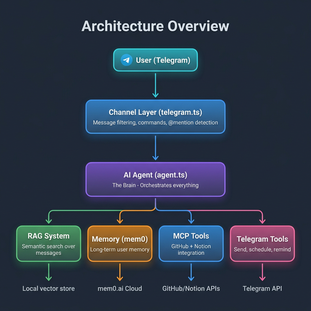
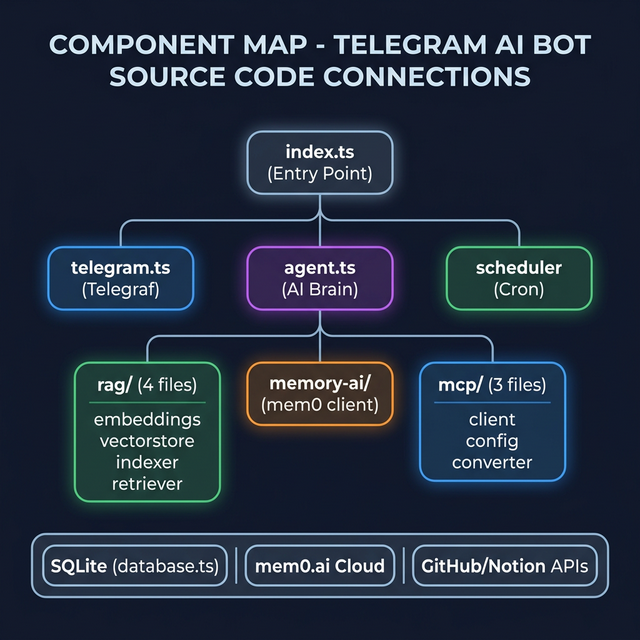
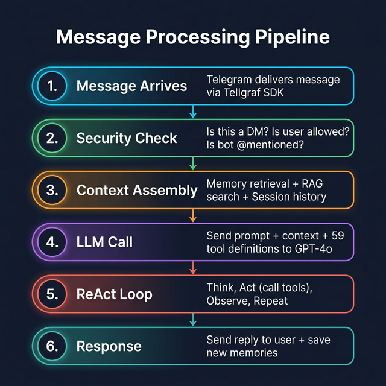

# 📐 Architecture Deep-Dive

> **This document explains how every component of the Telegram AI Assistant connects. This project is a mini implementation of the [OpenClaw](https://openclaw.ai) architecture — understanding this codebase will help you understand how OpenClaw works internally.**
>
> 📚 **New to AI concepts?** Read [CONCEPTS.md](./CONCEPTS.md) first — it explains what LLMs are, the ReAct pattern, how tool calling works, and why RAG & Memory exist.

---

## Table of Contents

- [OpenClaw Context](#openclaw-context)
- [System Overview](#system-overview)
- [Component Map](#component-map)
- [1. Telegram Channel Layer](#1-telegram-channel-layer)
- [2. AI Agent (The Brain)](#2-ai-agent-the-brain)
- [3. RAG System](#3-rag-system)
- [4. Memory System](#4-memory-system)
- [5. MCP Integration](#5-mcp-integration)
- [6. Database Layer](#6-database-layer)
- [7. Configuration System](#7-configuration-system)
- [Complete Message Flow](#complete-message-flow)
- [OpenClaw vs This Project](#openclaw-vs-this-project)
- [File-by-File Reference](#file-by-file-reference)

---

## OpenClaw Context

[OpenClaw](https://docs.openclaw.ai) is an open-source, self-hosted personal AI assistant framework. It supports multiple messaging platforms (WhatsApp, Telegram, Discord, iMessage), multi-agent routing, and a Gateway control plane.

This project implements **the same core architecture patterns** in a simplified form:

| OpenClaw Concept | This Project |
|-----------------|-------------|
| Gateway (multi-channel control plane) | Single Telegram channel handler |
| Agent Workspace (SOUL.md, IDENTITY.md) | Single agent with system prompt |
| File-first Memory (daily Markdown logs) | Vector-based Memory (OpenAI embeddings) |
| Durable Memory (MEMORY.md) | Long-term Memory (mem0.ai) |
| MCP Tool Servers | MCP Client (GitHub + Notion) |
| SQLite session store | SQLite session store (same pattern!) |

---

## System Overview

The system is built in **layers**. Each layer is independent — you could swap Telegram for Discord, or GPT-4o for Claude, without touching the other layers. This is the same design principle OpenClaw uses.



---

## Component Map



---

## 1. Telegram Channel Layer

**File:** `src/channels/telegram.ts`  
**OpenClaw equivalent:** Gateway Channel Adapter

This is where messages enter and exit the system. In OpenClaw, the Gateway supports multiple channels simultaneously. In this project, we focus on Telegram.

### How Messages Are Filtered

```typescript
// In the main text handler, these checks happen in order:

1. Is this a private chat (DM)?
   → YES: Always process the message
   → NO: Continue to check #2

2. Is this a group chat and the bot is @mentioned?
   → YES: Remove @mention and process the message
   → NO: Ignore the message (don't respond to everything in groups)

3. Is the user allowed?
   → Check TELEGRAM_ALLOWED_USERS environment variable
   → If set to "*": everyone is allowed
   → Otherwise: check if user's Telegram ID is in the list

4. All checks passed → Send typing indicator → Call agent.processMessage()
```

---

## 2. AI Agent (The Brain)

**File:** `src/agents/agent.ts`  
**OpenClaw equivalent:** Agent Workspace (SOUL.md + AGENTS.md + TOOLS.md)

In OpenClaw, each agent has a workspace directory with Markdown files defining its personality, memory, and tools. In this project, we define everything in code.

### The `processMessage()` Function

```
processMessage(message, context)
  │
  ├── 1. Load session history from SQLite
  │
  ├── 2. Retrieve memories from mem0 (if enabled)
  │      "User prefers Python, works on web app"
  │
  ├── 3. Check if RAG is needed (if enabled)
  │      Does the message ask about past discussions?
  │      If yes → Retrieve relevant messages from vector store
  │
  ├── 4. Build the full prompt:
  │      System Prompt + Memory Context + RAG Context + History + User Message
  │
  ├── 5. Call OpenAI with all available tools:
  │      12 Telegram tools + 26 GitHub tools + 21 Notion tools
  │
  ├── 6. Process tool calls in a loop:
  │      While LLM wants to call tools:
  │        → Execute the tool (Telegram action, GitHub API, or Notion API)
  │        → Send result back to LLM
  │        → LLM decides: call another tool or generate final response
  │
  ├── 7. Store new memories (background, after responding)
  │
  └── 8. Return final response text
```

### Tool Routing

```typescript
if (toolName.startsWith('github_') || toolName.startsWith('notion_')) {
  // Route to MCP server
  const result = await executeMCPTool(serverName, toolName, args);
} else {
  // Route to built-in Telegram tools
  switch (toolName) {
    case 'send_message':     return sendMessage(args);
    case 'search_knowledge_base': return retrieve(args.query);
    case 'get_my_memories':  return getAllMemories(userId);
    // ... etc
  }
}
```

---

## 3. RAG System

**Files:** `src/rag/embeddings.ts`, `vectorstore.ts`, `indexer.ts`, `retriever.ts`  
**OpenClaw equivalent:** Memory system with hybrid semantic search

For full details, see [RAG.md](./RAG.md).

```
"What did we discuss about the API?"
        │
        ▼
  Convert to vector → Find similar vectors → Return top matches
```

**Key difference from OpenClaw:** OpenClaw uses a "file-first" approach with Markdown daily logs and hybrid BM25 + vector search. This project uses a pure vector approach with OpenAI embeddings.

---

## 4. Memory System

**Files:** `src/memory-ai/mem0-client.ts`, `src/memory/database.ts`  
**OpenClaw equivalent:** Ephemeral Memory + Durable Memory (MEMORY.md)

For full details, see [MEMORY.md](./MEMORY.md).

| Type | Where | OpenClaw Equivalent |
|------|-------|---------------------|
| **Short-term** | SQLite | Ephemeral Memory (daily logs) |
| **Long-term** | mem0.ai cloud | Durable Memory (MEMORY.md) |

---

## 5. MCP Integration

**Files:** `src/mcp/client.ts`, `config.ts`, `tool-converter.ts`  
**OpenClaw equivalent:** MCP Gateway tool routing

For full details, see [MCP.md](./MCP.md).

```
Bot Startup → Spawn MCP servers → Discover tools → Merge with Telegram tools
              (GitHub, Notion)     (47 tools)       (59 total)
```

---

## 6. Database Layer

**File:** `src/memory/database.ts`

SQLite database with these tables:

| Table | Purpose | Key Columns |
|-------|---------|-------------|
| `sessions` | Track conversation sessions | `id`, `user_id`, `channel_id`, `session_type` |
| `messages` | Store conversation history | `session_id`, `role`, `content`, `message_ts` |
| `scheduled_tasks` | Store scheduled/recurring tasks | `user_id`, `task_description`, `cron_expression` |
| `pairing_codes` | DM security (pairing mode) | `code`, `user_id`, `expires_at` |
| `approved_users` | Pre-approved DM users | `user_id`, `approved_at` |

---

## 7. Configuration System

**File:** `src/config/index.ts`  
**OpenClaw equivalent:** `~/.openclaw/openclaw.json`

Uses **Zod** for runtime validation. If a required env var is missing, the bot exits with a clear error.

---

## Complete Message Flow



---

## OpenClaw vs This Project

| Feature | OpenClaw | This Project |
|---------|---------|-------------|
| **Channels** | WhatsApp, Telegram, Discord, iMessage, Web | Telegram only |
| **Agents** | Multiple agents with workspace isolation | Single agent |
| **Agent Config** | Markdown files (SOUL.md, IDENTITY.md, etc.) | System prompt in code |
| **Memory** | File-first Markdown + hybrid search | Vector-first + mem0.ai |
| **MCP** | Full Gateway with multi-server routing | Client with GitHub + Notion |
| **Sessions** | Per-sender with workspace isolation | Per-user in SQLite |
| **Install** | `npm install -g openclaw@latest` | `git clone` + `npm install` |

> 📖 **Learn more:** [docs.openclaw.ai](https://docs.openclaw.ai) | [github.com/openclaw/openclaw](https://github.com/openclaw/openclaw)

---

## File-by-File Reference

| File | Lines | Purpose |
|------|:-----:|---------|
| `src/index.ts` | ~60 | Entry point: initializes DB, RAG, MCP, Memory, starts bot |
| `src/config/index.ts` | ~130 | Environment variable loading and validation |
| `src/channels/telegram.ts` | ~350 | All Telegram message and command handling |
| `src/agents/agent.ts` | ~800 | AI agent: context assembly, LLM calls, tool routing |
| `src/rag/embeddings.ts` | ~230 | OpenAI text-embedding API wrapper |
| `src/rag/vectorstore.ts` | ~370 | Local JSON-based vector storage and search |
| `src/rag/indexer.ts` | ~410 | Real-time message indexing |
| `src/rag/retriever.ts` | ~430 | Semantic search and result formatting |
| `src/memory/database.ts` | ~450 | SQLite database for sessions, messages, tasks |
| `src/memory-ai/mem0-client.ts` | ~250 | mem0.ai cloud integration |
| `src/tools/telegram-actions.ts` | ~300 | Telegram API operations |
| `src/tools/scheduler.ts` | ~200 | Cron-based task scheduler |
| `src/mcp/client.ts` | ~200 | MCP server connection management |

---

## Next Steps

- **[RAG.md](./RAG.md)** — How semantic search works, with code examples
- **[MEMORY.md](./MEMORY.md)** — How the memory system extracts and stores facts
- **[MCP.md](./MCP.md)** — How GitHub & Notion integration works
- **[OpenClaw Docs](https://docs.openclaw.ai)** — Official OpenClaw documentation
