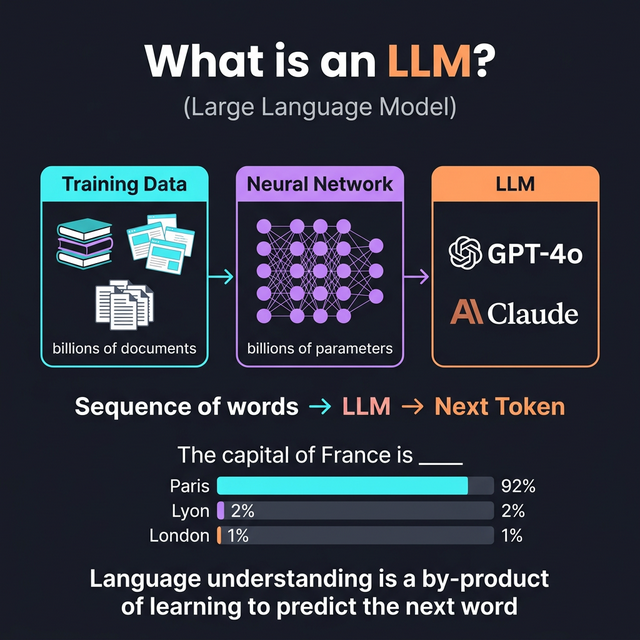
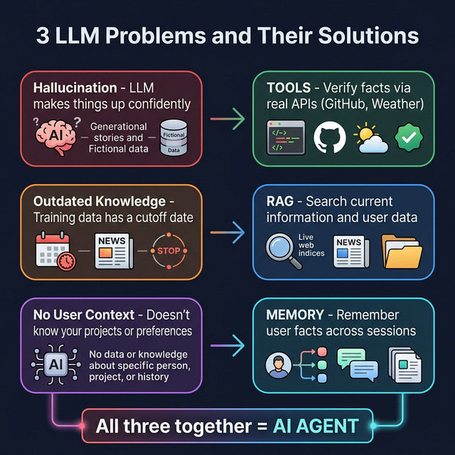
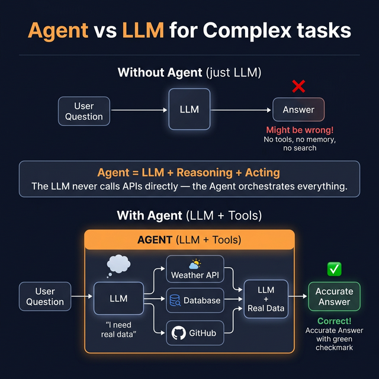
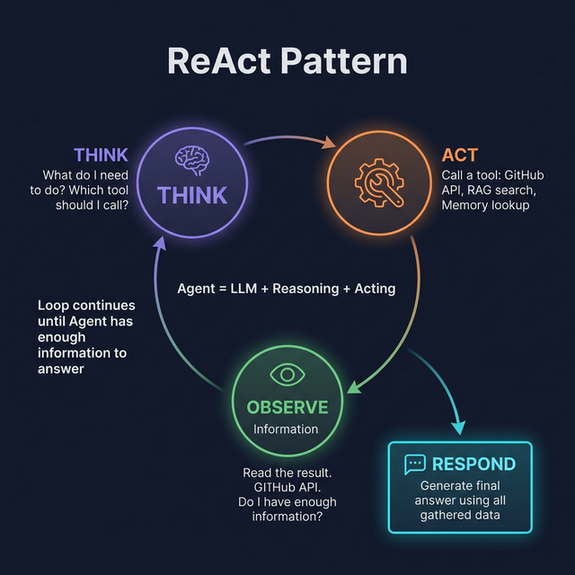
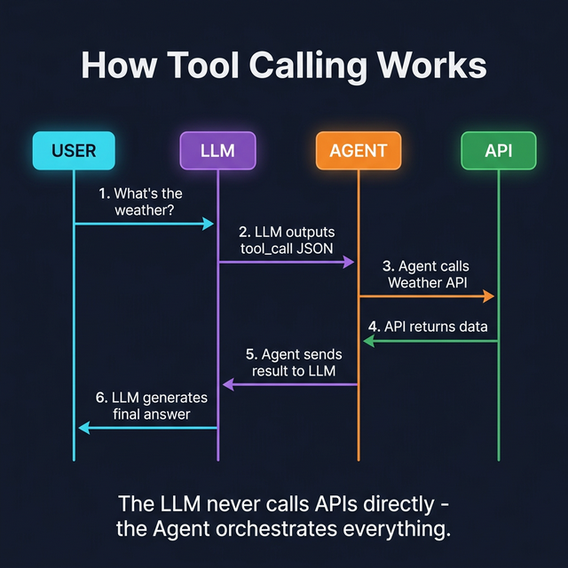
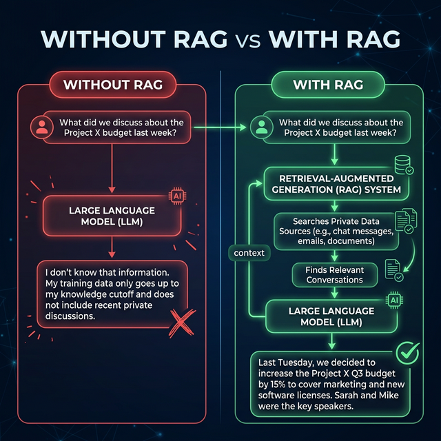
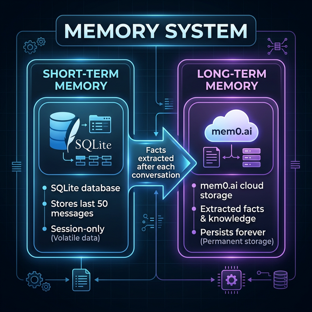
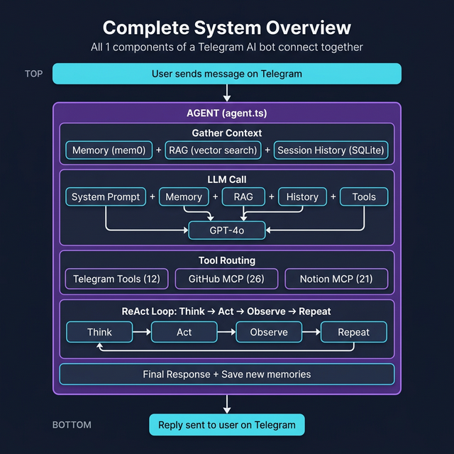

# 📚 Core Concepts — Understanding AI Assistants from Scratch

> **Before diving into the code, you need to understand the foundational concepts. This guide explains everything from "What is an LLM?" to "How do agents use tools?" — with diagrams and examples.**
>
> This project is a mini implementation of [OpenClaw](https://openclaw.ai). Understanding these concepts will help you understand both this project AND the full OpenClaw framework.

---

## Table of Contents

- [1. What Is an LLM?](#1-what-is-an-llm)
- [2. The Problem: Why LLMs Aren't Enough](#2-the-problem-why-llms-arent-enough)
- [3. What Is an Agent?](#3-what-is-an-agent)
- [4. The ReAct Pattern](#4-the-react-pattern)
- [5. How Tool Calling Works](#5-how-tool-calling-works)
- [6. Why RAG Exists](#6-why-rag-exists)
- [7. Why Memory Exists](#7-why-memory-exists)
- [8. Putting It All Together](#8-putting-it-all-together)

---

## 1. What Is an LLM?



### The Alien Analogy

Imagine you're an alien 👽 who knows **mathematics** and can **think**, but you **don't know any human language**.

Someone gives you a task:

> *"Here's an incomplete sentence. Predict the next word."*

How would you do it? You don't know English!

**Answer:** You'd read ALL the text data on Earth — every book, every website, every conversation — and **estimate the probability** of which word comes next.

```
"The cat sat on the ___"

Your probability estimates:
  "mat"    → 35% chance
  "floor"  → 20% chance
  "table"  → 15% chance
  "roof"   → 10% chance
  "dog"    → 2% chance
  ...
  40,000+ possible words, each with a probability
```

### The Combinatorial Explosion

But it's not just one word — it's sequences of words:

```
For 1 word:   40,000 options
For 2 words:  40,000 × 40,000 = 1.6 BILLION options
For 3 words:  40,000 × 40,000 × 40,000 = 64 TRILLION options

That's more possibilities than particles in the universe! 🤯
```

### The Solution: A Neural Network with Billions of Parameters

What if we build a model that **learns** these probability patterns from data?

```
Raw Text Data          Statistical           Neural              Large Language
(Books, Web,    →     Patterns        →     Network       →     Model (LLM)
 Wikipedia)          (Word co-occurrence)   (Deep learning)     (Billions of params)

"I love ___"         "pizza" appears        Layers of math      GPT-4: 1.7T params
                     after "love" in        that capture         Claude: unknown
                     12% of training        meaning, grammar,    Gemini: unknown
                     data                   context, & more
```

### The Key Insight

> **An LLM is a next-token prediction machine.**
>
> `Sequence of words → LLM → Next token`
>
> **Language understanding is a by-product** of learning to predict the next word really well. The model doesn't "understand" language — it's incredibly good at pattern matching across billions of examples.

---

## 2. The Problem: Why LLMs Aren't Enough

LLMs are powerful but have **three critical limitations**:

### Problem 1: Hallucination 🤥

LLMs **make things up** confidently. Since they only predict probable next tokens, they can generate plausible-sounding but completely false information.

```
You:  "Who won the 2026 Super Bowl?"

LLM (without tools): "The Kansas City Chiefs won the 2026 Super Bowl,
                      defeating the San Francisco 49ers 31-24."

                      ← This could be completely made up!
                        The LLM is just generating probable text,
                        not checking facts.
```

### Problem 2: Outdated Knowledge 📅

LLMs are trained on data up to a **cutoff date**. They don't know what happened after training.

```
Training data cutoff: April 2024

You:  "What's the latest version of React?"

LLM:  "React 18.2"  ← Wrong! React 19 was released,
                       but the LLM doesn't know this.
```

### Problem 3: No Access to Your Data 🔒

LLMs don't know about YOUR projects, messages, documents, or code.

```
You:  "What did my team decide about the database migration?"

LLM:  "I don't have access to your team's conversations." 😕
```

### The Solutions



---

## 3. What Is an Agent?

### The Formula

> **Agent = LLM + Reasoning + Acting (Tools)**

An LLM by itself can only generate text. An **Agent** wraps the LLM with the ability to:
1. **Reason** about what to do
2. **Act** by using tools (APIs, databases, search)
3. **Observe** the results
4. **Respond** with accurate, grounded information



In this project, `agent.ts` is the Agent. The LLM is GPT-4o (called via OpenAI API). The agent receives the LLM's tool call requests and executes them.

---

## 4. The ReAct Pattern

**ReAct** stands for **Re**asoning + **Act**ing. It's the loop that makes agents work.



### The Loop

### Real Example of ReAct in This Bot

```
User: "Create a GitHub issue for the login bug we discussed last week"

━━━ THINK (Step 1) ━━━
LLM: "The user wants to create a GitHub issue about a login bug.
      They mentioned 'we discussed last week' — I should search
      past messages first to find details about this bug."

━━━ ACT (Step 1) ━━━
Agent calls: search_knowledge_base("login bug")
             → RAG searches vector store

━━━ OBSERVE (Step 1) ━━━
Result: "Found 3 messages:
  [Jan 15] alice: 'Users can't login after 30 minutes - session expires'
  [Jan 16] bob: 'It's the JWT token TTL, it's set to 1800s'
  [Jan 16] alice: 'We need to add a refresh mechanism'"

━━━ THINK (Step 2) ━━━
LLM: "Now I have the bug details. I should create a GitHub issue
      with this information. Let me call the GitHub tool."

━━━ ACT (Step 2) ━━━
Agent calls: github_create_issue({
  owner: "my-org", repo: "my-app",
  title: "Login session expires after 30 minutes",
  body: "Users can't login after 30 minutes due to JWT token TTL..."
})

━━━ OBSERVE (Step 2) ━━━
Result: { number: 42, url: "https://github.com/my-org/my-app/issues/42" }

━━━ RESPOND ━━━
Bot: "✅ Created issue #42 based on your discussion from last week:
     
     Title: Login session expires after 30 minutes
     Details: JWT token TTL is set to 1800s, needs refresh mechanism
     🔗 https://github.com/my-org/my-app/issues/42"
```

### How This Maps to Our Code

```
In agent.ts:

1. THINK  → LLM receives context + tools + message
             and decides what to do

2. ACT    → Agent detects tool_call in LLM response
             and routes it to the right handler:
             - github_* → MCP GitHub server
             - notion_* → MCP Notion server
             - search_knowledge_base → RAG retriever
             - get_my_memories → mem0 client

3. OBSERVE → Agent sends tool result back to LLM

4. Loop   → LLM can call more tools or generate final response

5. RESPOND → Agent returns the final text to telegram.ts
```

---

## 5. How Tool Calling Works



### Step 1: Tell the LLM What Tools Exist

Tools are defined as **JSON descriptors** and injected into the system prompt. You must be **very precise** about what each tool does and what inputs it expects.

```json
{
  "type": "function",
  "function": {
    "name": "get_weather",
    "description": "Get the current weather for a specific location",
    "parameters": {
      "type": "object",
      "properties": {
        "city": {
          "type": "string",
          "description": "The city name, e.g., 'London'"
        },
        "units": {
          "type": "string",
          "enum": ["celsius", "fahrenheit"],
          "description": "Temperature units"
        }
      },
      "required": ["city"]
    }
  }
}
```

### Step 2: LLM Decides to Call a Tool

When the LLM receives a question, it checks if any of its available tools can help:

```
User: "What's the weather in Tokyo?"

LLM thinks: "I have a get_weather tool that can answer this.
             I should NOT guess the weather — I should use the tool."

LLM outputs (instead of a text response):
{
  "tool_calls": [{
    "function": {
      "name": "get_weather",
      "arguments": "{\"city\": \"Tokyo\", \"units\": \"celsius\"}"
    }
  }]
}
```

### Step 3: Agent Executes the Tool

The **agent** (not the LLM!) catches this tool call and executes it:

### In This Project: 59 Tools Available

```
12 Telegram Tools:     send_message, search_knowledge_base, get_my_memories...
26 GitHub Tools (MCP):  github_create_issue, github_search_code...
21 Notion Tools (MCP):  notion_search, notion_get_page...
─────────────────────
59 Total Tools          All provided as JSON to the LLM in every request
```

The LLM sees ALL 59 tool definitions and decides which ones (if any) to call for each user message.

---

## 6. Why RAG Exists

### The Problem RAG Solves

```
LLM Training Data:  Billions of web pages (up to cutoff date)

What LLM DOESN'T know:
  ❌ Your team's conversations
  ❌ Your project decisions
  ❌ Your meeting notes
  ❌ Anything after training cutoff
  ❌ Private/internal information
```

### The RAG Solution

**R**etrieval **A**ugmented **G**eneration — search your data first, then give it to the LLM:



> 📖 Full details in [RAG.md](./RAG.md)

---

## 7. Why Memory Exists

### The Problem Memory Solves

Every LLM call is **stateless** — the LLM doesn't remember previous conversations:

```
Call 1: "My name is Alex"           → LLM processes, responds, FORGETS
Call 2: "What's my name?"           → LLM: "I don't know" 😕
```

### The Memory Solution



> 📖 Full details in [MEMORY.md](./MEMORY.md)

---

## 8. Putting It All Together

Here's how all these concepts combine in this project:



### Concept → Code Mapping

| Concept | Where in Code | What It Does |
|---------|--------------|-------------|
| **LLM** | OpenAI API call in `agent.ts` | Next-token prediction engine |
| **Agent** | `agent.ts` → `processMessage()` | Orchestrates LLM + tools + memory |
| **ReAct Loop** | Tool call loop in `agent.ts` | Think → Act → Observe → Respond |
| **Tool Definitions** | JSON schemas in `agent.ts` + MCP `tool-converter.ts` | Tell LLM what tools exist |
| **Tool Execution** | `agent.ts` routing + `telegram-actions.ts` + MCP `client.ts` | Agent runs tools, sends results back |
| **RAG** | `src/rag/` (4 files) | Search past messages to prevent hallucination |
| **Short-term Memory** | `src/memory/database.ts` | Session history (last 50 messages) |
| **Long-term Memory** | `src/memory-ai/mem0-client.ts` | Cross-session fact storage |
| **MCP** | `src/mcp/` (4 files) | Standard protocol for external tools |

---

## Further Reading

Now that you understand the concepts, dive into the implementation:

- **[ARCHITECTURE.md](./ARCHITECTURE.md)** — How these concepts are implemented in code
- **[RAG.md](./RAG.md)** — Deep dive into semantic search implementation
- **[MEMORY.md](./MEMORY.md)** — Deep dive into the memory system
- **[MCP.md](./MCP.md)** — Deep dive into GitHub & Notion integration
- **[OpenClaw Docs](https://docs.openclaw.ai)** — The full framework this project is based on
