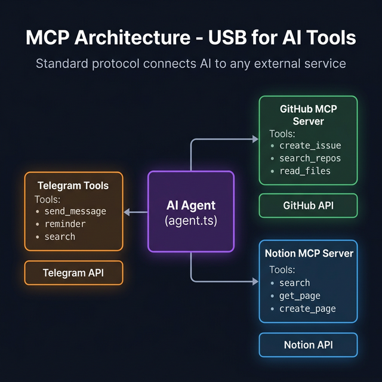

# 🔌 MCP — Model Context Protocol (GitHub & Notion Integration)

> **MCP lets the bot interact with GitHub and Notion through natural language — creating issues, searching repos, reading Notion pages, and more.**
>
> **OpenClaw equivalent:** OpenClaw uses MCP extensively as its tool integration layer. Its Gateway acts as a full MCP host with multi-server routing. This project implements the same MCP client pattern in a simplified form.



---

## Table of Contents

- [What Is MCP? (Simple Explanation)](#what-is-mcp-simple-explanation)
- [How OpenClaw Uses MCP](#how-openclaw-uses-mcp)
- [What Can the Bot Do with MCP?](#what-can-the-bot-do-with-mcp)
- [How It Works (Under the Hood)](#how-it-works-under-the-hood)
- [Setup Guide](#setup-guide)
- [All Available Tools](#all-available-tools)
- [Real Conversation Examples](#real-conversation-examples)
- [Configuration](#configuration)
- [Adding More MCP Servers](#adding-more-mcp-servers)
- [Troubleshooting](#troubleshooting)
- [Security](#security)

---

## What Is MCP? (Simple Explanation)

### The Problem

Every AI application implements external tools differently. If you want your bot to use GitHub, you'd normally write hundreds of lines of custom API code.

### The MCP Solution

**MCP (Model Context Protocol)** is a standard created by Anthropic. It works like **USB for AI tools**:

```
Before MCP:                          With MCP:
                                     
Custom GitHub code ──→ Your bot      GitHub MCP Server ──→ Standard Protocol ──→ Any AI
Custom Notion code ──→ Your bot      Notion MCP Server ──→ Standard Protocol ──→ Any AI
Custom Jira code   ──→ Your bot      Jira MCP Server   ──→ Standard Protocol ──→ Any AI
                                     
(Write everything yourself)          (Use pre-built servers, standard interface)
```

**Think of it like USB:** Before USB, every printer had a different cable. After USB, any printer works with any computer. MCP is that "USB standard" for AI tools.

---

## How OpenClaw Uses MCP

In the full [OpenClaw](https://docs.openclaw.ai) framework, MCP is central to the architecture:

| Feature | OpenClaw | This Project |
|---------|---------|-------------|
| **MCP Host** | Gateway acts as full MCP host with multi-server routing | Simple MCP client |
| **Tool Discovery** | Automatic discovery + agent-specific tool policies | Automatic discovery |
| **Servers** | Supports any MCP server dynamically | GitHub + Notion (pre-configured) |
| **Tool Policies** | TOOLS.md defines allowed/blocked tools per agent | All discovered tools available |
| **Security** | Token auth, allowlists, audit logging | Env var tokens, basic logging |

> 💡 **Key insight:** OpenClaw's MCP Gateway is more sophisticated — it can route tool calls to different agents and enforce per-agent tool policies. This project shows the core MCP client pattern that underlies all of that.

---

## What Can the Bot Do with MCP?

### GitHub (26 Tools)

```
You: "List my GitHub repositories"
Bot: ✅ Fetches your repos and shows them

You: "Create an issue for the login bug"
Bot: ✅ Creates a real GitHub issue and gives you the URL

You: "Show me the README from my-org/my-app repo"
Bot: ✅ Reads the file content from GitHub

You: "Search for TODO comments in my code"
Bot: ✅ Searches across all your repos
```

### Notion (21 Tools)

```
You: "Search my Notion for project roadmap"
Bot: ✅ Searches all your Notion pages

You: "Read the Q4 Goals page"
Bot: ✅ Gets the full content of the page

You: "Create a new page for today's meeting notes"
Bot: ✅ Creates a new Notion page
```

---

## How It Works (Under the Hood)

### Architecture


### Startup Process

```
Step 1: READ CONFIGURATION
  ├── Check for mcp-config.json file
  └── OR use default config from environment variables

Step 2: SPAWN SERVER PROCESSES
  ├── GitHub: npx -y @modelcontextprotocol/server-github
  └── Notion: npx -y @notionhq/notion-mcp-server

Step 3: DISCOVER TOOLS
  ├── GitHub server responds: 26 tools
  └── Notion server responds: 21 tools

Step 4: CONVERT & MERGE
  ├── Prefix tools: create_issue → github_create_issue
  └── Total: 12 Telegram + 26 GitHub + 21 Notion = 59 tools
```

### When a Tool Gets Called

```
User: "Create an issue for the login bug in my-org/my-app"
                    │
                    ▼
LLM: "Call github_create_issue"
      Args: { owner: "my-org", repo: "my-app", title: "Login bug" }
                    │
                    ▼
Agent: Tool starts with "github_" → Route to MCP
       Strip prefix → Send to GitHub MCP server
                    │
                    ▼
GitHub MCP Server: POST /repos/my-org/my-app/issues
                    │
                    ▼
Result: { number: 42, url: "https://github.com/my-org/my-app/issues/42" }
                    │
                    ▼
Bot: "✅ Created issue #42 in my-org/my-app"
```

---

## Setup Guide

### 1. Get a GitHub Token

1. Go to [github.com/settings/tokens](https://github.com/settings/tokens)
2. Click **"Generate new token (classic)"**
3. Select scopes: ✅ `repo`, ✅ `issues`, ✅ `read:user`
4. Copy the token (starts with `ghp_`)

```env
GITHUB_PERSONAL_ACCESS_TOKEN=ghp_your_token_here
```

### 2. Get a Notion Token

1. Go to [notion.so/my-integrations](https://www.notion.so/my-integrations)
2. Click **"New integration"** → Name it → Copy the token (starts with `secret_`)
3. **⚠️ Important:** Share your pages with the integration:
   - Open any Notion page → "..." → "Add connections" → Select your integration

```env
NOTION_API_TOKEN=secret_your_token_here
```

### 3. Restart the Bot

```bash
npm run dev
# Should see: [info] ✅ MCP initialized: github, notion
```

---

## All Available Tools

### GitHub Tools (26)

| Tool | What It Does | Example Prompt |
|------|-------------|---------------|
| `github_search_repositories` | Search for repos | *"Find repos about machine learning"* |
| `github_get_repository` | Get repo details | *"Tell me about my-org/my-app"* |
| `github_list_issues` | List issues | *"What are the open issues?"* |
| `github_create_issue` | Create a new issue | *"Create an issue for the login bug"* |
| `github_get_issue` | Get issue details | *"What's issue #42 about?"* |
| `github_update_issue` | Update an issue | *"Close issue #42"* |
| `github_list_pull_requests` | List PRs | *"Any open pull requests?"* |
| `github_create_pull_request` | Create a PR | *"Create a PR from feature to main"* |
| `github_get_file_contents` | Read a file | *"Show me the README"* |
| `github_search_code` | Search code | *"Find TODOs in my code"* |
| ... and 16 more | | |

### Notion Tools (21)

| Tool | What It Does | Example Prompt |
|------|-------------|---------------|
| `notion_search` | Search all pages | *"Search Notion for project roadmap"* |
| `notion_get_page` | Get page content | *"Read the Q4 Goals page"* |
| `notion_create_page` | Create a new page | *"Create meeting notes for today"* |
| `notion_update_page` | Update properties | *"Mark the task as done"* |
| `notion_query_database` | Query a database | *"Show tasks due this week"* |
| ... and 16 more | | |

---

## Real Conversation Examples

### Creating a GitHub Issue

```
You:  We found a bug where users can't login after 30 minutes.
      Can you create an issue for this?

Bot:  ✅ Created issue #42 in my-org/my-app:
      
      Title: Login session expires after 30 minutes
      Labels: bug
      
      🔗 https://github.com/my-org/my-app/issues/42
```

### Searching and Reading Code

```
You:  Can you find where authentication is handled in my repo?

Bot:  Found 4 relevant files:
      
      1. 📄 src/auth/handler.ts — Session validation logic
      2. 📄 src/middleware/auth.ts — Route protection
      3. 📄 src/config/auth.ts — Token expiry config (30min)
      4. 📄 tests/auth.test.ts — Auth test cases
      
      Would you like me to read any of these?
```

### Searching Notion

```
You:  What do we have in Notion about the Q4 product launch?

Bot:  Found 4 pages about Q4 product launch:

      1. 📄 Q4 Launch Plan (edited 2 days ago)
      2. 📄 Marketing Strategy Q4 (edited 1 week ago)
      3. 📄 Q4 Launch Checklist (edited 3 days ago) — 15/23 tasks done
      4. 📄 Q4 Goals & OKRs (edited 2 weeks ago)
      
      Would you like me to read any of these in detail?
```

### Combined RAG + Memory + MCP

```
You:  Search our conversations for bugs we discussed, then create
      issues for them in my-org/my-app.

Bot:  🔍 Searching message history for bug discussions...
      [RAG: Found 3 actionable bugs]

      Creating GitHub issues:
      
      • ✅ #42: Login timeout after 30 minutes
      • ✅ #43: API rate limiter not working for burst traffic
      • ✅ #44: Dark mode CSS overflow on mobile devices

      Created 3 issues in my-org/my-app! 🎉
```

---

## Configuration

### Option 1: Environment Variables (Simple)

```env
GITHUB_PERSONAL_ACCESS_TOKEN=ghp_your_token_here
NOTION_API_TOKEN=secret_your_token_here
```

### Option 2: MCP Config File (Advanced)

Create `mcp-config.json` in the project root:

```json
{
  "servers": [
    {
      "name": "github",
      "command": "npx",
      "args": ["-y", "@modelcontextprotocol/server-github"],
      "env": {
        "GITHUB_PERSONAL_ACCESS_TOKEN": "ghp_..."
      }
    },
    {
      "name": "notion",
      "command": "npx",
      "args": ["-y", "@notionhq/notion-mcp-server"],
      "env": {
        "OPENAPI_MCP_HEADERS": "{\"Authorization\": \"Bearer secret_...\", \"Notion-Version\": \"2022-06-28\"}"
      }
    }
  ]
}
```

---

## Adding More MCP Servers

### Popular MCP Servers

| Server | What It Does | Package |
|--------|-------------|---------|
| **Filesystem** | Read/write local files | `@modelcontextprotocol/server-filesystem` |
| **PostgreSQL** | Query databases | `@modelcontextprotocol/server-postgres` |
| **Brave Search** | Web search | `@modelcontextprotocol/server-brave-search` |
| **Google Drive** | Access Drive files | `@modelcontextprotocol/server-gdrive` |

### How to Add a New Server

1. Add to `mcp-config.json`
2. Restart the bot
3. New tools automatically discovered and available!

---

## Troubleshooting

### ❌ "MCP server not connected"
Token is missing or invalid.
```bash
# Test GitHub token:
curl -H "Authorization: token YOUR_TOKEN" https://api.github.com/user
```

### ❌ "GitHub: Not Found"
Wrong repo name. Use `owner/repo` format:
```
✅ "my-org/my-app"
❌ "my-app" (missing owner)
```

### ❌ "Notion: Unauthorized"
Page not shared with your integration. Open page → "..." → "Add connections".

### ❌ "Tool not being used"
Be explicit:
```
❌ "What repos do I have?"        → LLM might answer from training data
✅ "Use GitHub to list my repos"  → LLM will call github_search_repositories
```

---

## Security

| Concern | Best Practice |
|---------|-------------|
| **Never commit tokens** | Use `.env` file (gitignored) |
| **Minimum scopes** | Only grant needed permissions |
| **Notion sharing** | Only share necessary pages |
| **Audit logging** | All tool calls are logged |

---

## Further Reading

- [ARCHITECTURE.md](./ARCHITECTURE.md) — How MCP fits into the system
- [RAG.md](./RAG.md) — How semantic search works alongside MCP
- [MEMORY.md](./MEMORY.md) — How memory complements MCP tools
- [OpenClaw Docs](https://docs.openclaw.ai) — How the full OpenClaw MCP Gateway works
