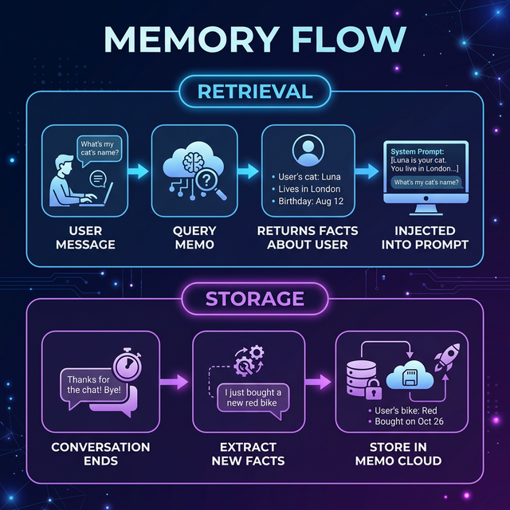

# 🧠 Memory System — mem0 Integration

> **The Memory system gives the bot long-term memory — it remembers your preferences, projects, and context across conversations, just like a real assistant would.**
>
> **OpenClaw equivalent:** OpenClaw uses a "file-first" approach with `MEMORY.md` for durable memory and daily Markdown logs for ephemeral memory. This project uses mem0.ai for durable memory and SQLite for ephemeral memory — same pattern, different storage.


---

## Table of Contents

- [What Is the Memory System?](#what-is-the-memory-system)
- [How OpenClaw Does Memory](#how-openclaw-does-memory)
- [Two Types of Memory](#two-types-of-memory)
- [How It Works (Step by Step)](#how-it-works-step-by-step)
- [What Gets Remembered?](#what-gets-remembered)
- [Real Conversation Examples](#real-conversation-examples)
- [Code Walkthrough](#code-walkthrough)
- [Memory Tools (User-Facing)](#memory-tools-user-facing)
- [Configuration](#configuration)
- [Privacy & Security](#privacy--security)
- [Limitations](#limitations)

---

## What Is the Memory System?

### The Problem: Goldfish Memory

Without memory, every conversation with a chatbot starts completely fresh:

```
━━━ Monday ━━━
You:  I'm a Python developer working on a REST API project.
Bot:  Great! How can I help?

━━━ Tuesday ━━━ (brand new session)
You:  Can you help me with the project?
Bot:  Which project? I don't have any context about what you're working on. 😕

━━━ Wednesday ━━━
You:  Write me a quick script to parse JSON
Bot:  Here's a JavaScript script...
You:  I told you I use Python! 😤
Bot:  Sorry, I didn't know that. 🤦
```

### With Memory: An AI That Actually Remembers

```
━━━ Monday ━━━
You:  I'm a Python developer working on a REST API project.
Bot:  Great! How can I help?
      [🧠 Memory stored: "User is a Python developer", "Working on REST API project"]

━━━ Tuesday ━━━
You:  Can you help me with the project?
Bot:  Sure! You're working on the REST API project, right?
      What do you need help with?
      [🧠 Retrieved memory: "Working on REST API project"]

━━━ Wednesday ━━━
You:  Write me a quick script to parse JSON
Bot:  Here's a Python script (since that's your language!):
      
      import json
      data = json.loads(raw_text)
      [🧠 Retrieved memory: "User is a Python developer"]
```

---

## How OpenClaw Does Memory

In the full [OpenClaw](https://docs.openclaw.ai) framework, memory works differently but follows the same principles:

| Feature | OpenClaw | This Project |
|---------|---------|-------------|
| **Ephemeral Memory** | Daily Markdown logs (`memory/YYYY-MM-DD.md`) — append-only, auto-loads last 2 days | SQLite session table — last 50 messages |
| **Durable Memory** | `MEMORY.md` file in workspace — human-editable, loaded in private sessions | mem0.ai cloud — AI-managed, loaded on every message |
| **Search** | Hybrid BM25 + vector search over Markdown files | Semantic search via mem0.ai API |
| **User Control** | Edit Markdown files directly | Use `get_my_memories`, `forget_about` commands |

> 💡 **Key insight:** OpenClaw's file-first approach makes memory transparent and human-editable. This project's mem0 approach makes it automatic but less visible. Both achieve the same goal: persistent context across sessions.

---

## Two Types of Memory

```

```

### Key Differences

| Feature | Short-Term (SQLite) | Long-Term (mem0) |
|---------|:---:|:---:|
| Stores raw messages | ✅ | ❌ |
| Stores extracted facts | ❌ | ✅ |
| Survives session restart | ❌ | ✅ |
| User can view | No | Yes (`get_my_memories`) |
| User can delete | Yes (`/reset`) | Yes (`forget_about`, `forget_everything`) |
| Requires API key | No | Yes (`MEM0_API_KEY`) |
| Storage location | Local file | mem0.ai cloud |

---

## How It Works (Step by Step)

### Step 1: Memory Retrieval (Before Responding)

```

```


## What Gets Remembered?

| Category | Examples |
|----------|---------|
| **Preferences** | "Prefers concise responses", "Likes dark mode", "Uses VS Code" |
| **Identity** | "Name is Alex", "Senior backend engineer", "Works at a startup" |
| **Projects** | "Working on REST API", "Q4 launch deadline is Dec 15" |
| **Technical** | "Expert in Python and FastAPI", "Learning Kubernetes" |
| **Relationships** | "Works with Bob on the ML project" |
| **Tools** | "Uses PostgreSQL for databases", "Prefers GitHub over GitLab" |
| **Communication** | "Prefers detailed explanations", "Appreciates code examples" |

---

## Real Conversation Examples

### Example 1: Building Context Over Time

```
━━━ Conversation 1 (Day 1) ━━━
You:  I'm a senior engineer. I work primarily in Python.
Bot:  Nice to meet you! How can I help?
      [🧠 Stored: "Senior engineer", "Works in Python"]

━━━ Conversation 2 (Day 3) ━━━
You:  I'm building a REST API for our payment system.
Bot:  Since you work in Python, are you using FastAPI or Flask?
      [🧠 Retrieved: "Works in Python"]
      [🧠 Stored: "Building REST API for payment system"]

━━━ Conversation 3 (Day 7) ━━━
You:  I need help with the deployment.
Bot:  For your payment system API, are you deploying to AWS,
      GCP, or something else? I can help with Docker + Gunicorn.
      [🧠 Retrieved: "Building REST API for payment system", "Works in Python"]
```

### Example 2: Memory Management

```
You:  What do you remember about me?

Bot:  Here's what I know about you:
      
      📝 Your Memories:
      1. Senior engineer
      2. Primarily works in Python
      3. Building REST API for payment system
      4. Prefers detailed explanations with code examples
      
      You can ask me to forget anything specific.

You:  Forget about the payment system

Bot:  ✅ Done! I've removed that memory.

You:  Remember that my new project is called "TaskFlow"

Bot:  ✅ Got it! I'll remember you're working on TaskFlow.
```

---

## Code Walkthrough

### How `addMemory()` Works

```typescript
// File: src/memory-ai/mem0-client.ts

export async function addMemory(
  messages: Array<{ role: string; content: string }>,
  userId: string,
): Promise<MemoryResult> {
  const result = await memoryInstance.add(messages, {
    user_id: userId,
    metadata: { source: 'telegram' },
  });
  return result;
}
```

### How `searchMemory()` Works

```typescript
export async function searchMemory(
  query: string,
  userId: string,
  limit: number = 5
): Promise<MemoryItem[]> {
  const results = await memoryInstance.search(query, {
    user_id: userId,
    limit: limit,
  });
  return results;
}
```

### How `buildMemoryContext()` Works

```typescript
export function buildMemoryContext(memories: MemoryItem[]): string {
  if (memories.length === 0) return '';
  return `## What You Know About This User\n\n` +
    memories.map(m => `• ${m.memory}`).join('\n') +
    `\n\nUse this information to personalize your responses.`;
}
```

---

## Memory Tools (User-Facing)

| Tool | What It Does | Example |
|------|-------------|---------|
| `get_my_memories` | Shows all stored memories | *"What do you remember about me?"* |
| `remember_this` | Explicitly stores a fact | *"Remember that my timezone is IST"* |
| `forget_about` | Deletes memories matching a topic | *"Forget about my old project"* |
| `forget_everything` | Deletes ALL memories for the user | *"Forget everything about me"* |

---

## Configuration

```env
# Enable or disable the memory system entirely
MEMORY_ENABLED=true

# mem0.ai cloud API key (get one at https://app.mem0.ai)
MEM0_API_KEY=m0-your-api-key-here

# OpenAI key is also needed (mem0 uses it for extraction)
OPENAI_API_KEY=sk-your-key-here
```

### Without mem0 API Key

- ✅ Short-term memory (session history) still works
- ❌ Long-term memory (cross-session facts) is disabled

---

## Privacy & Security

| Concern | How It's Handled |
|---------|-----------------|
| **Who can see my memories?** | Memories are scoped to your user ID |
| **Can I delete my data?** | Yes — `forget_about` or `forget_everything` |
| **Where is data stored?** | Long-term: mem0.ai cloud. Short-term: local SQLite |
| **Can the bot share memories?** | No — memories are strictly per-user |

---

## Limitations

| Limitation | Details |
|-----------|---------|
| **Extraction quality** | Depends on the LLM's ability to identify facts |
| **Latency** | Memory retrieval adds ~100-200ms |
| **Cloud dependency** | Long-term memory requires mem0.ai API |
| **Cost** | Small OpenAI API cost for fact extraction |

---

## Further Reading

- [ARCHITECTURE.md](./ARCHITECTURE.md) — How memory fits into the overall system
- [RAG.md](./RAG.md) — How semantic search complements memory
- [MCP.md](./MCP.md) — How external tools work alongside memory
- [OpenClaw Docs](https://docs.openclaw.ai) — How the full OpenClaw memory system works
