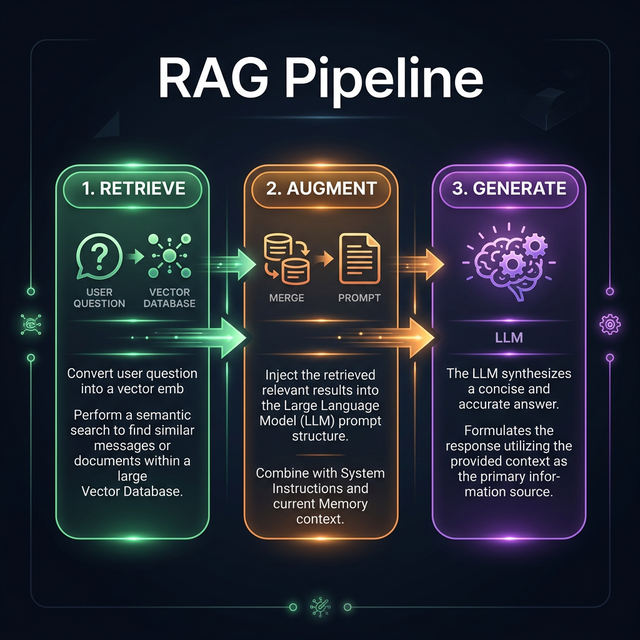
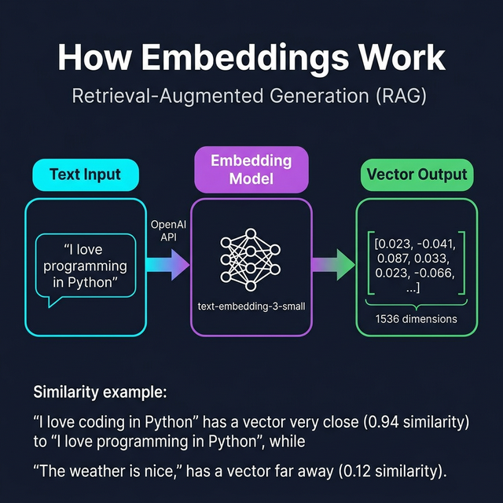
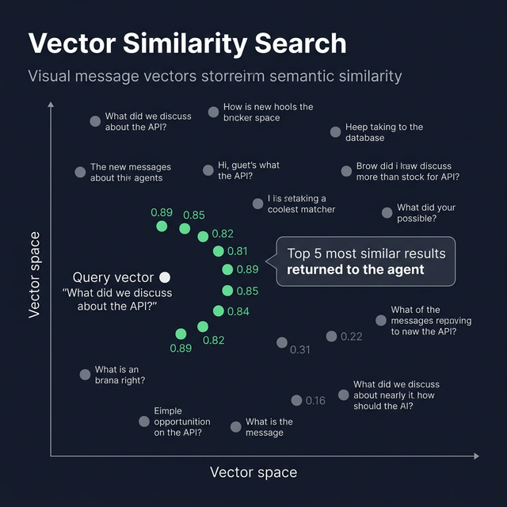

# 🔍 RAG — Retrieval Augmented Generation

> **RAG lets the bot search your message history using AI — finding relevant conversations even when different words were used.**
>
> **OpenClaw equivalent:** OpenClaw uses a "file-first" memory approach with Markdown daily logs and hybrid BM25 + vector search. This project implements the same semantic search concept using pure vector embeddings — simpler to understand, same core idea.



---

## Table of Contents

- [What Is RAG? (Simple Explanation)](#what-is-rag-simple-explanation)
- [Why Do We Need RAG?](#why-do-we-need-rag)
- [How RAG Works (Step by Step)](#how-rag-works-step-by-step)
- [The Four RAG Components](#the-four-rag-components)
- [Real-World Examples](#real-world-examples)
- [Code Walkthrough](#code-walkthrough)
- [Configuration](#configuration)
- [Performance & Limitations](#performance--limitations)

---

## What Is RAG? (Simple Explanation)

Imagine you have a **library with thousands of books**. Someone asks you:

> *"What did Einstein say about time?"*

**Without RAG (keyword search):** You search for the exact word "time" in every book. You find thousands of results — most irrelevant (cooking times, train times, etc.).

**With RAG (semantic search):** You *understand* the question is about physics and relativity. You go straight to the physics section and find the relevant Einstein quotes — even if they use words like "spacetime", "relativity", or "fourth dimension" instead of "time".

### The Same Concept for Chat Messages

```
WITHOUT RAG (keyword search):
  Query: "What was the database decision?"
  Searches for: "database" AND "decision"
  Misses: "We chose PostgreSQL for the JSON support"  ← No word "decision"!
  Misses: "MongoDB vs Postgres — we went with Postgres" ← No word "database"!

WITH RAG (semantic search):
  Query: "What was the database decision?"
  Understands: User wants to know about choosing a database technology
  Finds: "We chose PostgreSQL for the JSON support" ✅
  Finds: "MongoDB vs Postgres — we went with Postgres" ✅
  Finds: "The DB migration to Postgres is complete" ✅
```

---

## Why Do We Need RAG?

### The Problem

Your chat messages are a goldmine of knowledge:
- **Past decisions:** "Why did we choose Redis over Memcached?"
- **Processes:** "How do we deploy to production?"
- **History:** "What happened during last month's outage?"
- **Expertise:** "Who knows about Kubernetes?"

But this knowledge is:
- 📦 **Scattered** across many conversations
- 📅 **Buried** in old messages
- 🔤 **Hard to search** with just keywords
- 🚪 **Lost** when people leave

### The RAG Solution

| Problem | RAG Solution |
|---------|-------------|
| Keywords miss relevant results | Understands *meaning*, not just words |
| Can't find old discussions | Searches ALL indexed messages instantly |
| No context for decisions | Returns the actual messages with dates and authors |
| Information is scattered | Unified semantic search across all conversations |

---

## How RAG Works (Step by Step)

RAG has two phases: **Indexing** (storing messages) and **Retrieval** (searching them).

### Phase 1: Indexing (Happens Automatically)

Every time a message arrives, it gets indexed in real-time:



### Phase 2: Retrieval (When You Ask a Question)



### What Is "Cosine Similarity"?

Think of it like **compass directions**. Two vectors pointing in the same direction are similar (score = 1.0). Two vectors pointing in opposite directions are dissimilar (score = -1.0).

```
"We chose PostgreSQL"     → vector pointing ↗ (northeast)
"Database decision"       → vector pointing ↗ (northeast)  ← SIMILAR! (0.89)
"Nice weather today"      → vector pointing ↙ (southwest)  ← DIFFERENT! (0.12)
```

---

## The Four RAG Components

### 1. Embeddings (`src/rag/embeddings.ts`)

**What:** Converts text into 1536-dimensional number arrays using OpenAI's API.

**Why 1536 dimensions?** Each dimension captures a different aspect of meaning — topic, sentiment, formality, technical level, etc. More dimensions = more nuance.

```typescript
// Example: What the function looks like conceptually
const embedding = await createEmbedding("We should use PostgreSQL");
// Returns: [0.023, -0.041, 0.087, ..., 0.012]  (1536 numbers)

// Similar texts produce similar embeddings:
cosine_similarity("use PostgreSQL", "database choice")  = 0.89  // HIGH
cosine_similarity("use PostgreSQL", "nice weather")     = 0.12  // LOW
```

**Cost:** OpenAI charges ~$0.00002 per 1K tokens. Indexing 10,000 messages costs about $0.20.

### 2. Vector Store (`src/rag/vectorstore.ts`)

**What:** Stores all the embeddings and searches them efficiently.

**How it stores data:**

```json
{
  "id": "msg_1705312200",
  "embedding": [0.023, -0.041, 0.087, ...],
  "text": "We should use PostgreSQL for better JSON support",
  "metadata": {
    "channelId": "123456",
    "channelName": "engineering",
    "userId": "789",
    "userName": "john",
    "timestamp": "2024-01-15T10:30:00Z",
    "messageTs": "1705312200"
  }
}
```

**How it searches:** When you search, it calculates cosine similarity between your query vector and EVERY stored vector, then returns the top matches ranked by score.

### 3. Indexer (`src/rag/indexer.ts`)

**What:** Takes new messages and feeds them into the embedding + vector store pipeline.

**Key concept — Real-Time Indexing:**

```
Why real-time?
  Telegram bots cannot fetch past message history.
  Unlike some other platforms, there's no "get all messages" API.
  So we index each message as it arrives.

How it works:
  1. telegram.ts receives a new message
  2. Calls indexSingleMessage() with the message text + metadata
  3. indexer creates the embedding via OpenAI
  4. Stores the vector + metadata in the vector store
  5. Message is now searchable!
```

### 4. Retriever (`src/rag/retriever.ts`)

**What:** The search interface. Takes a user query, finds relevant messages, and formats them for the LLM.

**Three main functions:**

| Function | What It Does |
|----------|-------------|
| `shouldUseRAG(message)` | Decides if the message needs RAG (asks about past conversations?) |
| `retrieve(query, options)` | Performs the actual semantic search |
| `buildContextString(results)` | Formats results into a string the LLM can read |

**Smart Query Filtering:**

```typescript
// The retriever can parse natural language filters:

"What did @john say about APIs?"
  → filters: { userName: "john" }

"What was discussed in #engineering last week?"
  → filters: { channelName: "engineering", timeFilter: "week" }
```

---

## Real-World Examples

### Example 1: Finding Past Decisions

```
You: "Why did we choose Redis for caching?"

What happens:
  1. Query embedded: "Redis caching decision" → [vector]
  2. Vector search finds 3 relevant messages:
     • "After comparing Redis vs Memcached, we went with Redis for persistence"
     • "Redis gives us pub/sub which we need for real-time updates"
     • "The caching layer will use Redis cluster for high availability"
  3. LLM synthesizes answer with citations:

Bot: "Based on past discussions in #engineering:
     
     The team chose Redis over Memcached for three reasons:
     1. **Persistence** — Redis can persist data to disk (john, Jan 15)
     2. **Pub/Sub** — Real-time update requirements (sarah, Jan 16)
     3. **Clustering** — High availability needs (mike, Jan 17)"
```

### Example 2: Finding Who Knows What

```
You: "Who knows about Kubernetes?"

What happens:
  1. Search for messages about Kubernetes
  2. Analyze who wrote them and how detailed they were
  3. Return expertise assessment

Bot: "Based on message history:
     • mike — 47 messages about K8s, including deployment strategies
     • sarah — 23 messages, focus on monitoring and alerts
     • john — 15 messages, mainly about local development"
```

### Example 3: Process Discovery

```
You: "How do we handle production incidents?"

Bot: "Based on past incidents and discussions:
     
     1. Alert — PagerDuty notifies on-call (discussed in #ops)
     2. Triage — Check Grafana dashboards (linked by sarah)
     3. Communication — Post in #incidents group
     4. Resolution — Follow runbook in Notion (shared by mike)
     5. Postmortem — Document within 48hrs"
```

---

## Code Walkthrough

### How `indexSingleMessage()` Works

```typescript
// File: src/rag/indexer.ts
// Called from telegram.ts every time a message arrives

async function indexSingleMessage(message: {
  text: string;
  userId: string;
  userName: string;
  channelId: string;
  channelName: string;
  timestamp: string;
}) {
  // Step 1: Skip very short messages (under 10 chars)
  if (message.text.length < 10) return;

  // Step 2: Create embedding via OpenAI
  const embedding = await createEmbedding(message.text);

  // Step 3: Store in vector store with metadata
  await vectorStore.addDocument({
    id: `${message.channelId}_${message.timestamp}`,
    text: message.text,
    embedding: embedding,
    metadata: {
      channelId: message.channelId,
      channelName: message.channelName,
      userId: message.userId,
      userName: message.userName,
      timestamp: message.timestamp,
    }
  });

  // Step 4: Update stats
  stats.documentsIndexed++;
}
```

### How `retrieve()` Works

```typescript
// File: src/rag/retriever.ts
// Called from agent.ts when the user asks about past discussions

async function retrieve(query: string, options = {}) {
  // Step 1: Convert query to embedding
  const queryEmbedding = await createEmbedding(query);

  // Step 2: Search vector store (cosine similarity)
  const results = await vectorStore.search(queryEmbedding, {
    limit: options.limit || 10,
    minScore: options.minScore || 0.5,
  });

  // Step 3: Format results for the LLM
  return results.map(doc => ({
    text: doc.text,
    score: doc.score,          // 0.0 to 1.0 relevance
    channel: doc.metadata.channelName,
    user: doc.metadata.userName,
    timestamp: doc.metadata.timestamp,
    formatted: `[${formatDate(doc.metadata.timestamp)} in #${doc.metadata.channelName}] ${doc.metadata.userName}: ${doc.text}`
  }));
}
```

---

## Configuration

```env
# Enable/disable RAG entirely
RAG_ENABLED=true

# Which OpenAI model to use for embeddings
RAG_EMBEDDING_MODEL=text-embedding-3-small

# Where to store vector data locally
RAG_VECTOR_DB_PATH=./data/chroma

# How many results to return per search
RAG_MAX_RESULTS=10

# Minimum similarity score (0.0 to 1.0)
# Lower = more results but less relevant
# Higher = fewer results but more relevant
RAG_MIN_SIMILARITY=0.5
```

---

## Performance & Limitations

### Performance Tips

| Tip | Why |
|-----|-----|
| Set `RAG_MIN_SIMILARITY` to 0.6+ | Filters out low-relevance noise |
| Keep `RAG_MAX_RESULTS` at 5-10 | Too many results overwhelm the LLM's context window |
| Short messages (< 10 chars) are skipped | "ok", "thanks", "lol" don't add search value |

### Limitations

| Limitation | Explanation |
|-----------|-------------|
| **No history import** | Telegram bots can't fetch past messages. Only new messages after the bot starts are indexed |
| **Embedding cost** | Each message costs a tiny amount via OpenAI API ($0.00002/1K tokens) |
| **Context window** | Can't include too many search results in the LLM prompt |
| **Quality depends on data** | If messages are vague or short, retrieval quality suffers |
| **Privacy** | All messages are embedded and stored locally |

---

## Further Reading

- [ARCHITECTURE.md](./ARCHITECTURE.md) — How RAG fits into the overall system
- [MEMORY.md](./MEMORY.md) — How the memory system complements RAG
- [MCP.md](./MCP.md) — How external tools integrate alongside RAG
- [OpenClaw Docs](https://docs.openclaw.ai) — How the full OpenClaw memory and search system works

